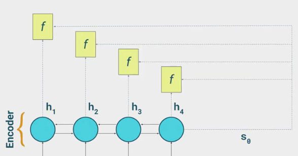
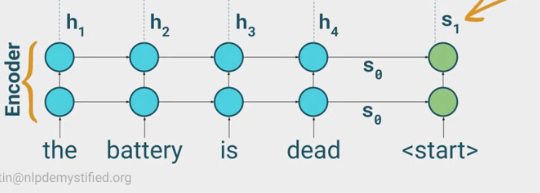

## **ATTENTION MECHANISM**
**Attention** in general is how to carry forward context in a sequence from prior timesteps or from many words ago.
- In seq2seq models rather than decoding timestep, the decoder accesses encoder's hidden states.
- at the end where encodings go to the decoder it goes through some scoring function f(h, s), this coring function can also be called an alignmnet model.
- this scoring function would then be applied to a the S0(the encoding of entire sequence) and also each of the hidden states.
---

- this scores would determine how much attention should each encoder hidden state be given for this decoding timestep
- these scores go through a softmax to transformthem into a a distribution that adds to 1, this way attention scores becomes a  proportion and so these are then called **attention weights**.
- next we have a context vector which combines all attention weights acc to the proportion its just the weighted sum of each attention weightw.r.t corresponding encoder hidden state(hi). 
- at decoder we say start with the start token's embeddings the context vector is concatenated with the embedding vectors.
- the combined concatenated vector leads to the first hidden state of the decoder which goes throgh the softmax to produce the 
- There are multiple variations of the scoring function
  - **Additive/Bahdanau attention** : f(hi, sj) = vTtanh(Whi + Usj)
  V - vector to make it scalar, W, U are randomly initialized set of weights, this scoring is trained like a FFN
  - **Multiplicative Luon Attention** :
  `f(hi, sj) = SjThi
  here there are 2 options dot product b/w decoder hidden state and each encoder hidden state or an addition of learnable weights - SjTW*hi
  
