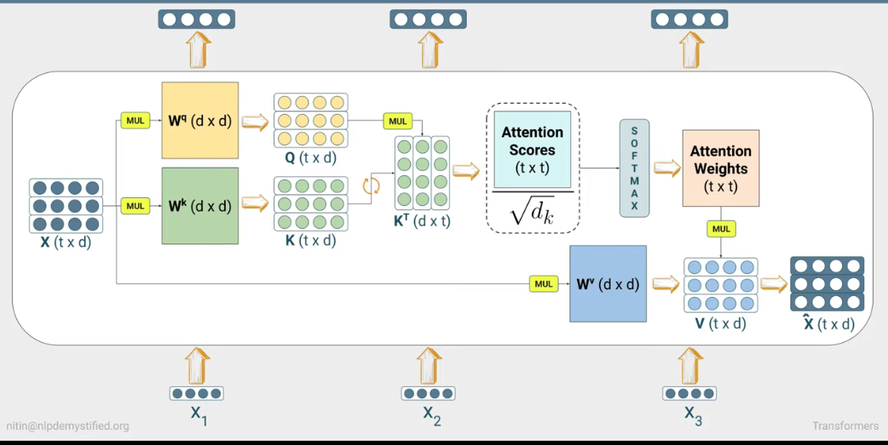
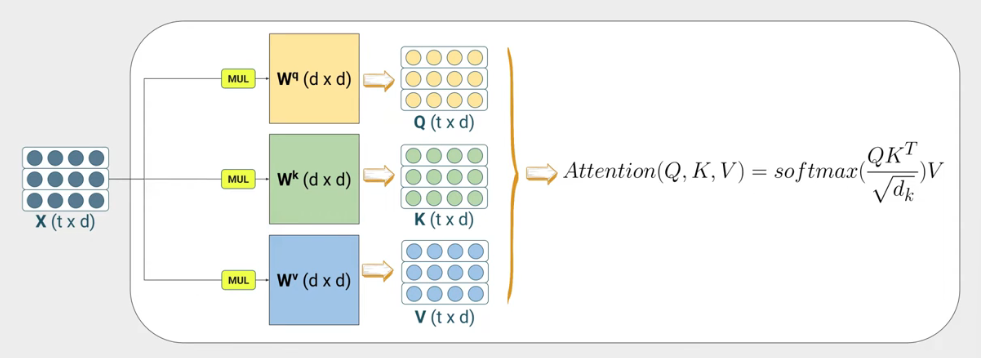

# **ATTENTION**
**Attention** in general is how to carry forward context in a sequence from prior timesteps or from many words ago.
- In seq2seq models rather than decoding timestep, the decoder accesses encoder's hidden states.
- at the end where encodings go to the decoder it goes through some scoring function f(h, s), this coring function can also be called an alignmnet model.
- this scoring function would then be applied to a the S0(the encoding of entire sequence) and also each of the hidden states.
---

- this scores would determine how much attention should each encoder hidden state be given for this decoding timestep
- these scores go through a softmax to transformthem into a a distribution that adds to 1, this way attention scores becomes a  proportion and so these are then called **attention weights**.
- next we have a context vector which combines all attention weights acc to the proportion its just the weighted sum of each attention weightw.r.t corresponding encoder hidden state(hi). 
- at decoder we say start with the start token's embeddings the context vector is concatenated with the embedding vectors.
- the combined concatenated vector leads to the first hidden state of the decoder which goes throgh the softmax to produce the 
- encoder hidden states can be viewed as an information store, current decoder state serves as a query and that implies  encoder hidden states being viewed as **keys** and **values** similar to dictionaries in python.
- There are multiple variations of the scoring function
  - **Additive/Bahdanau attention** : f(hi, sj) = vTtanh(Whi + Usj)
  V - vector to make it scalar, W, U are randomly initialized set of weights, this scoring is trained like a FFN
  - **Multiplicative Luon Attention** :
  `f(hi, sj) = SjThi
  here there are 2 options dot product b/w decoder hidden state and each encoder hidden state or an addition of learnable weights - SjTW*hi
  
  - current hidden state is used for scoring, a context vector is calculated and then concatenated with the decoder hidden state which are then multiplied by another set of weights and then run through tanh to produce s^ j which is run through softmax to generate the next word.
  - All these variants are forms of global attention where all the encoder hidden states can be computationally expensive.

### Shortcomings of recurrence based attention & RNNs
- computing attention at particular timetsep reqs all previous timesteps all to be recomputed
- final hidden state has to capture a lot long dist relationships

## SELF ATTENTION
- We throw away recurrence and base each encoder output on all encoder inputs
- Simpler version - embeddings are multiplied with itself (dot prod) these then go through softmax to produce attention weights, attention weights are multiplied with input embeddings which produce encoder outputs
- Issues - No learnable weights apart from embedding layer

### Scaled Dot Product Self Attention
----
- rather than multiplying raw embeddings we turn them into queries, keys and values.
- embedding X1, X2..X3(assume 3 embeddings in seq2seq model) is multiplied by Wq for query vector, Wk for key vector and finally Wv for value vector
- Q1, K1, V1 are X1*Q1,..,X1*V1 and we do this with X2, X3 to produce Q2, K2, V2..Q3..V3.
- Q1 is multiplied by evecry key vector (K1, K2, K3) - Q1*K1, Q1*K2..
- the result of above is used to create attention weights which is taking these attention score and putting it through a softmax, but attention scores are scaled by root of the key size (sqrt(dk)) tyhen put through softmax
- we take these attention weights (**a**) and perform a weighted sum of value vectors (Wv) and produce the output
x̂² = summation(j)(aijWvj)
- same things is done for the next encoder input using second query 
- this can be done in a single pass where the Q,K,V Weights are produced for all words in a single pass. 

Formula can be written as this:
Attention(Q, K, V) = softmax(QKT/sqrt(dk))*V --> **x̂** (t x d)
- this mechanism where attention weights go in produce Q, K, V is called an attention head(single)

above is a single attention head

- Self Attention struggles to capture multiple relationships in a sequence at once - `Adam went to Mcdonalds to meet his friend that afternoon`.
- What, Where, Who & When are the components we need to attend to whereas Self Attention only focuses on singularly where one embedding gets the focus.

---
## **MULTI HEAD ATTENTION**
- Instead of single head we have multiple heads wit their own set of Q, K, V weights of dimension d x d/h, h is no. of heads.
- each head mechanism remains the same, it will have their own keys, queries and value matrices and they go through their own scaled self attention in each of the heads
- each cell produces its own output which is then concatenated and run through a d X d linear layer ( output dimension is lower since initial weights were of d X d/no. of heads).  
<em>the randomly initialized weights Wq are supposed to be different in all 3 heads not same random weight matrice but in practice same are used</em>  

- In original transformer the embedding dimension is 512 (dmodel), no. of attention heads are 8,`d/h ` = 64
- Relating any 2 inputs becomes an O(1) operation
- the output of the multi head self attention layer is fed to a FFN in the original transformer
- Original transformer used 2 layer network with ReLU activation
- each embedding is passed on to the FFN point wise 

## Multi-Query Atention
Multi-Query Attention (MQA) is a type of attention mechanism that can accelerate the speed of generating tokens in the decoder while ensuring model performance. Issues with standard generation with autoregressive language model:-
- during inference each position's query attends to all the key-value pairs generated on or before the position, the output self attention(single head in MHA) layer at a specific position affects generation of next token as parallel computation does'nt happen so decoding becomes slow.
MQA simplifies this by sharing the same set of keys and values across multiple heads while maintaining different queries for each head
Key Concepts it introduces are: 
- Shared Keys and Values- MQA uses the same keys and values for all attention heads whilst the set of queries are different for each attention head
- given embedding dimension d = 512, h = 8 heads and dk = 64   
for MHA:  
Wq (512, 512) -> gets sliced into 8 x 64 
Wk (512, 512) -> gets sliced into 8 x 64  
Wv (512, 512)  -> gets sliced into 8 x 64 
for MQA:  
Wq (512, 512) -> 8 query heads of size 64 
Wk (512, 512) -> single key head of size 64
Wv (512, 512) -> single key head of size 64

### Computation in MQA (for single head)
**Head1 = Softmax(Q1 * K T/sqrt(dk)) * V**
**Head2 = Softmax(Q2 * K T/sqrt(dk)) * V**

Practically (`MQA.py`) we use tensor broadcasting- the single K & V tensors automatically broadcasr acros all h query heads during matmul - `Q @ K.transponse`