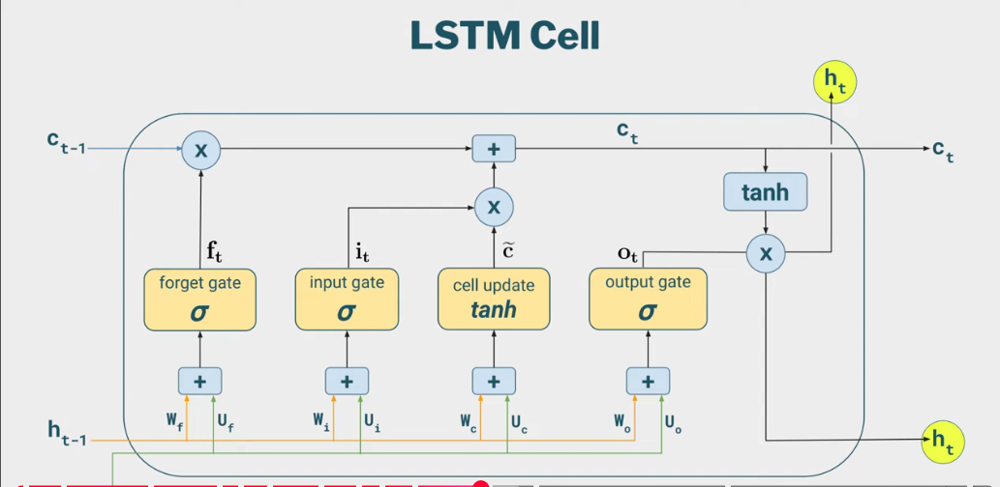
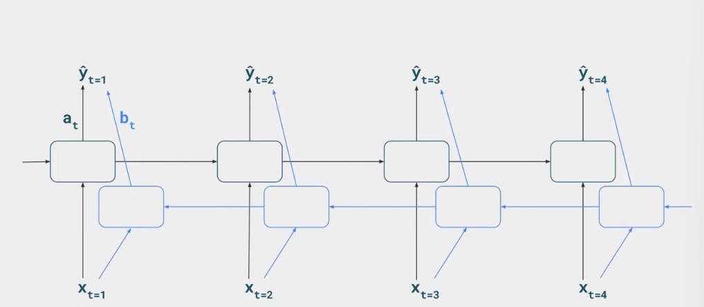

## RNNs and Sequence Modelling
- Prior Techniques include Bag-Of-Words, TFIdf for text vectorization
- Bow creates a list of all unique words in a document collection and counts the occurences of every word in individual docs
- TF-IDF(Term frequency Inverse document frequency) - measures importance by balancing how often a word appears in a single doc with how rare its across all docs, It multiplies word count in specific doc(TF) by IDF(a log scale of how rare the word is across whole corpus)
- static word embeddings included relative meaning of words, document vectors would become the average of these embeddings.
- these techniques encountered problems where two sentences `man bites dog` and `dog bites man` would end up with same Bow even though clearly different, word order was not accounted.
- **Recurrents** - approach is to add a recurrent layer where the hidden layer would recieve two inputs - current input X and output of hidden layer from previous time step
- hidden layer would then recieve 2 inputs the emnedding for say 2nd word in the sequence as well as the ouput of previous word in the hidden layer.
- so Xt =1, ht=1, yt=1 network recieves input word `The`'s embeddings at Xt=2, ht=2, .. network recieves `Dog` and hidden layer output from previous time step t=1. 
<em>Note: Reminder RNNs processed one word at a time which has shifted now with the transformer architrecture(easy to forget)</em>
- Following this Yt=3 took sequence upto that time step so word 3's embeddings and outputs from ht=1 and ht=2 as well and final timestep would take final word and hidden layer outputss of all prior timesteps.
- Simple RNN uses only 1 hidden layer, similar
- Weight matrices are randomly initialized - Wxh (for inputs) and Whh(for previous hidden state) and also a bias bh
- (Xt*Wxh) + (Ht-1*Whh) + bh  output maybe generated at a step Ht or at the end at final timestep Yt = Softmax((Ht*Why) + by), or any activation function.
- other possibilities are to avg or max of all hidden states and feed into a classifier.

### Backpropogation and Learning though time
- Loss Fn Lt can be Categorical cross entropy
- overall loss for a single sequence then becomes the summation of losses dived by T 
1/T(summation(t=1, T) of Lt) 
<em> t= current timestep, T= no. of timesteps </em>

- this is for sequence labelling for some other task it could be only the last Loss function value at last timestep
- weights updated are Wxh - weights multiplied to Xt(word embeddings) then Whh - weights multiplied to previous hidden layer output and W(hy) is the one multiplied for producing the final output Yt for every timestep
- partial derivates of Wxh w.r.t loss L is calculated by summing partial derivatives of the weight at every timestep so for Why --> partialDer(Why) = (summation(t=1, T)partialDer(Why). <em>DL/DWhy.

- loss L depends on Yhat the output which becomes `DL/Dyhat*Dyhat/Dqt*Dqt/DWhy = DL/DWhy`
- qt = Why*ht (or any of the three weights in ques ) and so our gradients are produced

- gradients for Dl/DWhh takes same summation but is broken up as:  
`DL/DWhh = DL/Dyhat*Dyhat/Dqt *Dqt/Dht *Dht/DWhh ` 
- Dht/DWhh = this is complex because h at any current timestep is dependent on previous timestep and previous one is dependent on its predecessor which becomes -
`Dht/Dht-1*Dht-1/Dht-2.Dht-2/Dw` this is why its called backpropogation through time
- RNNs compared to Plain FFNs can model sequential info, handle variable length inputs and take entire sequenes into accounts
- For Language Modelling which determines probability of a sequence of words 

### Training LMs with RNNS
- segment data into chunks/sentences paragrpahs etc. each piece becomes one training sample
- training begins by feeding the first word embedding through the RNN and after going throgh the final layer and the softmax an we get a probability distribution for next likely word through the entire vocabulary
- this happens bcoz Why initially randomly initialized but matches the vocab size's shape and so over multiple timesteps which is based on no. of words in the example the weight matrice's probablity numbers and refined and it learns the next word in the sequence.
<em> Note: vocab size is entire vocab not sequence length of one example </em>

- because we want next word in the sample of a sequence we set the true Y to be that word so `Cat loves Fish n Chips` loves become the target at t=1 
- and at t=2 second word's embeddings and the hidden layer's output is fed to the Network.
- each timestep becomes a classification task where inputs become current word and hidden state, output is probability of each word in vocab being next, technique is called **teacher forcing**.
- **Text Generation** : a particular token word or a `<start>` special token can either be fed to network, output layer produces that disribution, to determine the next word the probability distribution is sampled (randomly draw the word rather than greedily always pick the highest probability number).
- till a certain limit is reached this continues or else the special end token `<end>` is generated, this is called **Autoregressive Generation**.
- **LM Evaluation** : Perplexity: measures inverse probablity of the test set (^-1) also its normalized by no. of words or Timesteps, lower the score the better.

**Issues with RNNS**
- long range dependencies get lost over many timesteps.
- vanishing/exploding gradients bcoz derivatives keep amounting closer and closer to zero due to repeated multiplications

### LSTM Cell(Long SHort Term Memory)
- LSTM cells replace normal Cells in RNNS
- LSTM cells have gates(NN layers) 
- It takes input Xt, ht-1 and an additional Ct-1(cell state)
- the weights multiplied with the Wxh, Whh with inputs are added and then they pass through a **forget gate** which is a sigmoid function which results in vectors
- since sigmoid is applied resultant vector contains 0s and 1s this allowsto carry important info forward and get rid off non important stuff this makes a sorta mask ft.
- what info is reqd to be added is deteremined through the **input gate** which is a sigmoid over which takes another randomly initialzied set of weights Wi multiplied with same inputs Xt and ht-1 this input gate `it` is another mask .
- the **cell update** is the next which is `c`, it takes another set of weights with the input Xt and the ht-1, this is run through a  tanh function, this gate represents the new info to be added.
- `c` and it is multiplied elemntwiseto gate the flow of new info
- remaining is to add the info of forget gate `f(t)XC(t-1) + i(t)Xc`, this c(t) is passed to next timestep, C(t-1) = previous cell state.
- finally the **output gate** O(t) = sigmoid(New sets of randomly initialized weights multiplied with Xt and ht-1)
- New hidden state is drawn from the current cell state C(t), its run through tanh -> tanh(c(t)) which is then multiplied with the output gate mask o(t)it produces the new hidden state ---> h(t)

### Ways to use RNNs
- stack RNNs, stacking multiple RNNS in a larger network.
- Bidirectional RNNs - have a RNN processing sequence in reverse order

- Yhat then would be produced by concatenating the outputs of the 2 RNNs and multiply it with a set of weights to reduce it to expected dimension.

## Seq2Seq Models
- Tasks like text to code or machine translation requires one sequence to generate a unfamiliar sequence, which is where Seq2Seq models come in
- Consists of 2 models Encoder(processes input sequence) and Decoder(responsible for generating the output sequence)
- submodels inside can be LSTMs, stcked RNNs, GRUs etc.
- encoder recieves the sequenece processes it then decoder this time starting with the <start> special token takes the most probable word out of vocabulary instead of sampling and the word then becomes the input for the next timestep
- decoder is trained to produce the correct target sentences, encoder is trained to produce better encodings
- effective decoing : **Beam Search** : track cumalative log probability of each branch & continue with the top k branches
`score(w1,..wt) = summation(i=1 to t)(logP(wi|wi-1..w1,x))`
- so based on beam width (k) we select those branches(words at first timestep) 
- for translation models one of the Evaluation is BLEU (Bilingual Evaluation Understudy)
-  BLEU - for a subset of source sentences there will be reference translations provided then measure similarity using n-gram overlap

**Information Bottleneck**
----
- encoder has to cram all info about the source sentence into a fixed-length vector, longer the source sequence greater  the info loss.
- This is where attention mechanisms come in
