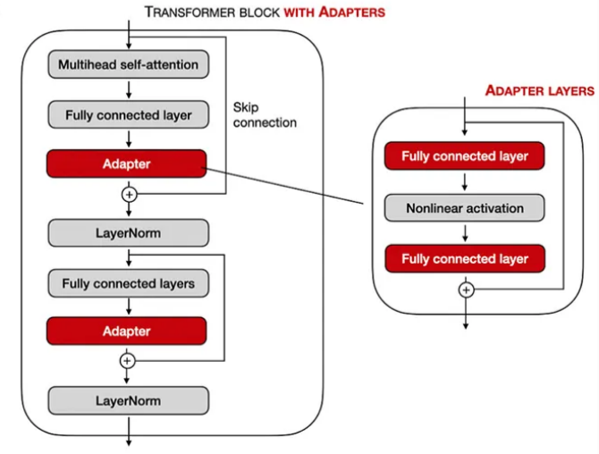

## **Fine Tuning**
Fine Tuning means training a pretrained model on new data to improve its performance on a specific task.  
LLM/Model fine tuning was to train the entire model the hidden layers b/w input & output on new data, the weights would be altered using the new data this was full **fine-tuning**.  
**Issues With Full Fine-Tuning**
- full network needs to be trained, which is computationally expensive
- storage req. for the checkpoints are expensive
- switching b/w diff full fine tuned models is difficult as models need to be loaded/unloaded

## PEFT(Parameter Efficient Fine Tuning)
Parameter efficient fine tuning overcomes issues listed above by fine tuning only a small subset of the model's parameters.  
When PEFT is used amount of storage required is also only a feww MBs for each downstream dataset which is very low. Pretrained model (or LLMS) is combined with the small trained weights from PEFT techniques and model can be used for numerous tasks.  
Several PEFT methods are there such as Adapter, LoRA,  QLoRA etc.   
**Adapter** - Adapter layers are added in b/w the model's different layers, eg. - adapeter layers are added after multi head attention and FFN layers in Transformers.

---

## LORA 

LORA stands for **Low Rank Adaptation** its a parameter efficient fine tuning technique, here Low Rank refers to minimum no. of rows and columns in a matrix, the rank is smaller than the dimensions of the matrix and it is basically a compact representation of a matrix.  
the matrix dimension is related to the rank of the matrix; LORA suggests adaptation through a low rank matrix, It freezes the pre-trained weights and adds a trainable piece of rank decomposition matrices into each layer of the model.  

**Wn = Wo + △W**

△W is constructed by multiplying B & A which are low-rank decomposed matrix where if assume  Wo has shape (d X k) then:-   

Matrix **A** - (down projection), shape = r x k  
Matrix A compresses the input dimension k down to small bottleneck rank r (r << min(d, k)), A is initialized with gaussian random numbers.  

Matrix **B** - (Up projection), shaper = d x r  
It projects the r-dimensional output back up to the original output dimension d, Its initialzed to all zeros
- since B starts at zeros △W = B * A = 0 at step 0 and so fine tuning starts wth exact model behaviour
- standard weight updates △W are full rank (d x k) by having △W = B * A, △W can have a maxium rank of onlr r.  
<em> **The above is because of the matrix Rank RUle rank(B * A) <= min(rank(B), rank(A))** </em>
- LORA matrices(A + B): (r x k) + (d x r) so eg. ( 8 x 4096 ) + (4096 X 8) = 65,536 compared to full rank 4096 x 4096 = 16.7M which is a ~99% reduction

**Forward Pass**:
- The output of B*A is scaled by a scaling factor α (alpha)and r (rank) as follows: (α / r), where r is the intrinsic dimension, typically ranging from 1 to 64 
 $$h = W_0 x + \frac{\alpha}{r} (B \cdot A) x$$

$\alpha$ is a constant scaling hyperparameter

LoRA is just one of several efficient fine-tuning approaches. A notable variant is Quantization LoRA (**QLoRA**), which combines high-precision computation with low-precision storage.

## QLORA
QLORA - Quantized LoRA is an efficient finetuning approach that reduces memory further while finetuning Large Language models. It Introduces multiple innovations to do so:-  
1) **4-bit NormalFLoat** - a quantization datatype for normally distributed data proposed to be better than 4-bit integers and 4-bit floats.
2) **Double Quantization** - a method which quantizes the quantization constants.
3) **Paged Optimizers** - pages optimizer states back n forth b/w GPU VRAM and CPU RAM.  
Essentially QLORA is an extended version of LoRA it works by quantizing the weight params in the pretrained LLM to 4-bit precision(typically in 32 bits), this makes fine tuning possible on a single GPU

### 4-bit Normal FLoat
NF4 is information theoretically optimal for data that has a normal distribution (common feature in NN weights) 
- 16-bit floats have 1 bit sign, 5 bit exponent and 10bit fraction
- bfloat16 has same for sign, exponent gets 8 bits and fraction gets 7 bbits

<em> fraction - mantissa </em>

NF4 has a range of [-8, 7] and Fp8 has [-127, 127], QLoRA uses brainfloat datatype to perform computational operation using backprop and forward passes. most weights are anyway clustered around 0.0 very few near extreme ends like -2.0 or +2.0.  
NF4 (quantiled quantization) designs its 16 bin values so that each of the 16 slots have an equal probability of recieving a weight, bins are spaced **close together around 0.0 and are sparse near the extremes**.
when a 16-bit weight matrix(FP16/BF16) is saved using NF4 QLORA sstores 2 things:
- 4 bit weight matrix every weight is mapped to an index from 0-15 corresponding to 16 NF4 quantile levels (packs 2 weights into a single byte)
- double quantile block scale constants - weights are split into blocks (typically size 64), each block gets a scaling constant c to normalize its weight into the range [-1, 1] before mapping to NF4. 

--- 

In QLORA   
**Total weight W = = Base Model (Frozen, 4-bit NF4) +  △W (Trainable, 16-bit FP16/BF16)**
- since A & B have tiny inner dimensions they account for less than 1% of total model params Keeping them in 16-bit precision ensures training stability and high-gradient accuracy while taking up negligible VRAM.

### How Optimizer States & Paged Memory Work
-  The optimizer states for $A$ and $B$ sit in GPU VRAM for fast backpropagation steps.
- f a long context sequence causes a temporary VRAM spike (activation memory), the Paged Optimizer automatically pages inactive parts of the Adam optimizer states out to CPU RAM via NVIDIA Unified Memory.
- Once the VRAM spike passes, those pages are swapped back into GPU VRAM as needed.  
Rest of the fine tuning process stays same